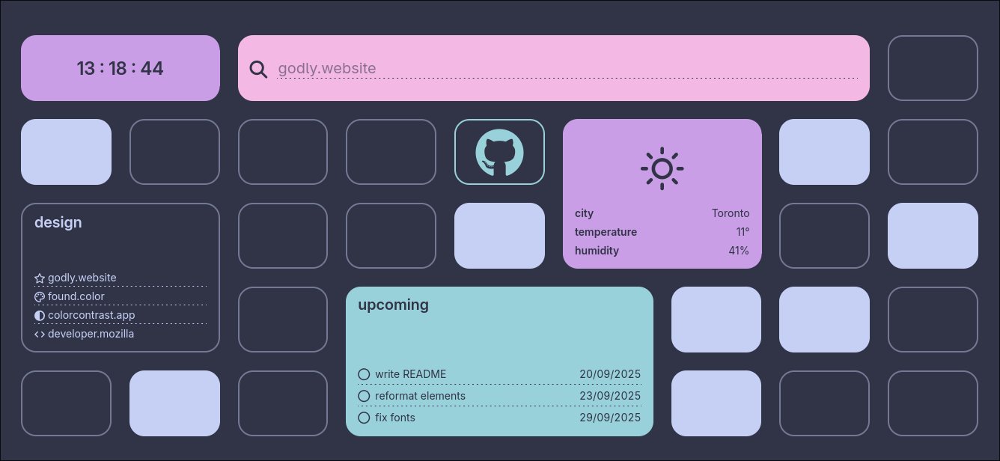

<p align="center">
  
</p>

<div align="center">
    <h1>Pomme</h1>
    <b>browser startpage with big, easy click buttons </b>
</div>

<p align="center">
    
</p>

## Index
- [Pomme Page](#)
  - [Usage](#Usage)
  - [Modules](#Modules)
  - [Customization](#Customization)
    - [Layout](#Layout)
    - [Theme](#Theme)

## Usage
1. Clone this repository:
    ```sh
    $ git clone https://github.com/weightedangelcube/pomme-page && cd pomme-page
    ```
2. Install dependencies:
    ```sh
    $ npm i
    ```
3. Duplicate the `.env.example` file, renaming it `.env`. Fill out all the fields indicated. 
4. Build the project:
    ```sh
    $ npm run build
    ```
5. Start the page:
    ```sh
    $ npm run preview
    ```
> [!WARNING]
> If you are using the Todoist module, do *NOT* deploy this project on the web! There is no backend to safeguard your API token. You have been warned.

Pomme will be running at `localhost:4321`. You can use browser extensions like [New Tab Override for Firefox](https://addons.mozilla.org/en-US/firefox/addon/new-tab-override/) to force your browser to redirect to this page.

Currently, there is no way to disable modules live. To disable a module, comment out its reference in `scripts/app.js` and remove it from `pages/index.astro`.

## Modules
Pomme uses modules to display information: 
- **myrtille** a big link with a nice icon of your favorite site
- **raisin** a list of categorized links
- **pomme** a spacer with a border
- **poire** a spacer filled in
- **clock** data and time
- **search** use your favourite search engine to browse the web
- **weather** add a window to look outside 
- **todoist** show all your tasks with a filter
## Customization
### Layout
Edit `pages/index.astro` to your liking:

#### search
- `url`: URL of the search engine. `%s` replaces your search term.

#### myrtille
- `url`: the link myrtille should point to.
- `icon`: any Nerd Font icon.

#### raisin
- `title`: title of the list.
- `links`: a JSON-formatted array of links and titles:
    ```json
    [ { "title": "my cool link", "url": "https://example.com" } ]
    ```

#### todoist
- `title`: title of the list.
- `filter`: the [filter](https://www.todoist.com/help/articles/introduction-to-filters-V98wIH) that should be applied to the tasks

### Theme
Pomme is currently themed with Catppuccin Frappé. Edit `styles/styles.css` to your liking.
